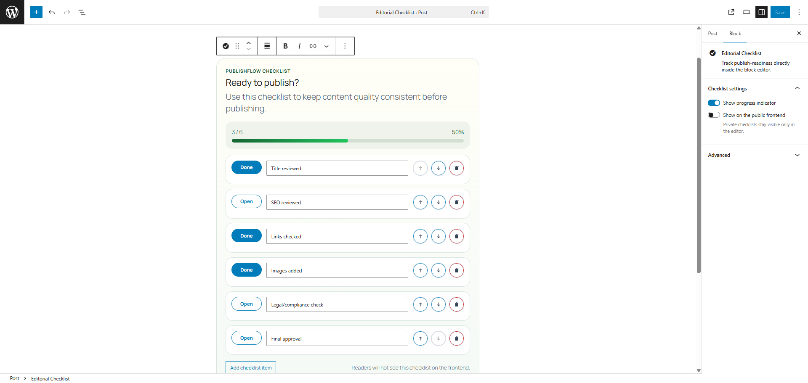
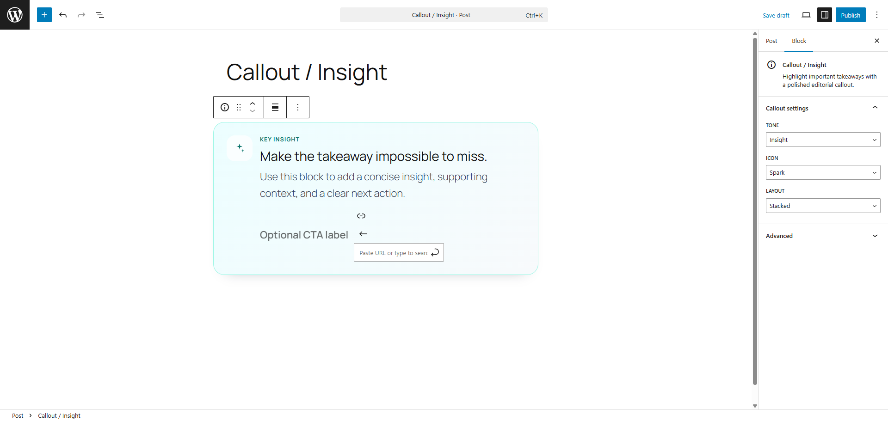
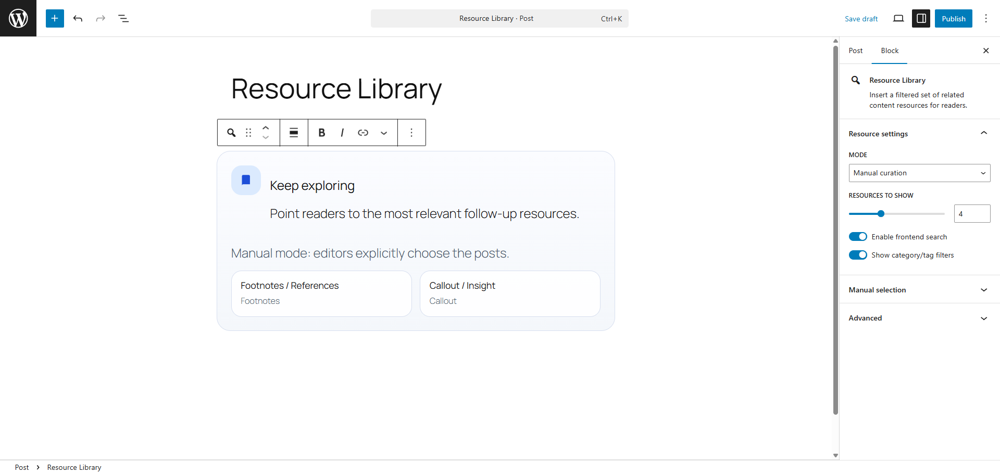
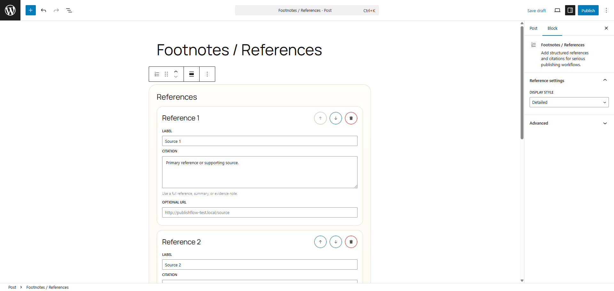

# PublishFlow Blocks

PublishFlow Blocks is a Gutenberg plugin for editorial and publishing workflows. Instead of offering a generic visual block pack, it focuses on structured content tools that help teams draft, review, and publish with more consistency.

The plugin currently includes four blocks:

- Editorial Checklist
- Callout / Insight
- Resource Library
- Footnotes / References

## Features

- `block.json`-driven block registration
- modern Gutenberg editor interfaces built with React components
- server-rendered blocks where markup stability matters
- Interactivity API support for frontend filtering in the Resource Library block
- namespaced PHP runtime code with clear service boundaries
- accessibility-minded controls and semantic frontend output
- translatable UI strings and defensive data handling
- shared utility helpers with JavaScript test coverage

## Included Blocks

### Editorial Checklist

The Editorial Checklist block gives writers and editors a lightweight publish-readiness workflow directly inside the block editor.



It supports:

- editable checklist items
- reorder and remove controls
- progress tracking
- private or public visibility
- stable server-rendered frontend output

### Callout / Insight

The Callout / Insight block is designed for key takeaways, highlighted guidance, and optional calls to action.



It supports:

- multiple tone variants
- multiple icon variants
- stacked or split layouts
- optional CTA label and URL

### Resource Library

The Resource Library block helps editors surface related content and follow-up reading.



It supports:

- manual or query-driven curation
- category and tag filtering
- frontend search and filtering
- Interactivity API-powered behavior
- transient-backed query caching in PHP

### Footnotes / References

The Footnotes / References block is intended for citations, source lists, and structured references.



It supports:

- ordered references
- editable labels, citations, and optional URLs
- reorder and remove controls
- compact and detailed presentation modes
- semantic ordered-list output on the frontend

## Use Cases

PublishFlow Blocks is a good fit for:

- editorial teams using checklists before publishing
- longform articles that need citations or references
- documentation and knowledge-base content
- resource hubs that benefit from related-content sections
- sites that want reusable callout patterns without ad hoc markup

## Requirements

- WordPress 6.6 or newer
- PHP 7.4 or newer
- Node.js and npm for local development builds

## Installation

### Standard WordPress Installation

1. Copy the `publishflow-blocks` folder into `wp-content/plugins/`.
2. Activate `PublishFlow Blocks` from the WordPress admin plugin screen.
3. Open the block editor and insert the blocks by name.

### Development Installation

From the plugin root:

```powershell
npm install
npm run lint:publishflow
npm run test:publishflow
npm run build:publishflow
```

The compiled assets are written to `build/blocks/*`.

## Editor Experience

Each block is built to feel native inside Gutenberg:

- block-level settings live in inspector controls
- content is edited inline where appropriate
- action controls remain visible and keyboard-accessible
- empty and configured states are designed to stay understandable

## Frontend Behavior

- Editorial Checklist can remain editor-only or render publicly
- Callout / Insight saves static block content
- Resource Library uses dynamic rendering and frontend filtering
- Footnotes / References renders semantic ordered output for publication use cases

## Architecture

Core runtime pieces:

- `publishflow-blocks.php`
  Main plugin bootstrap and constant definitions.
- `src/php/Plugin.php`
  Wires plugin services during WordPress initialization.
- `src/php/Infrastructure/BlockRegistry.php`
  Registers compiled block metadata from `build/blocks/*`.
- `src/php/Blocks/*`
  One class per block, including dynamic rendering where needed.
- `src/php/Support/ResourceLibraryQueryService.php`
  Query and caching service for related content retrieval.
- `src/blocks/*`
  Block-specific editor code, metadata, and styles.
- `src/shared/*`
  Shared icons, defaults, utility helpers, and tests.

Additional implementation notes live in [docs/architecture.md](./docs/architecture.md).

## Key Design Decisions

### Block Attributes vs Post Meta

Block state is stored in block attributes rather than post meta.

Benefits:

- each block instance stays portable with post content
- blocks can be duplicated without synchronization issues
- there is no hidden global state for editorial widgets

Tradeoff:

- checklist and reference data is instance-scoped rather than centrally shared

### Dynamic Rendering vs Static Save

The checklist, resource library, and footnotes blocks are dynamic. The callout block is static.

Why:

- the checklist can cleanly hide itself when marked private
- the resource library needs query-backed frontend output
- the footnotes block benefits from normalized semantic markup

Tradeoff:

- more PHP rendering logic to maintain

### Interactivity API vs Ad Hoc Frontend JavaScript

The resource library uses the Interactivity API rather than a custom DOM scripting approach.

Benefits:

- smaller, more intentional frontend behavior surface
- native alignment with modern WordPress block tooling
- clearer state handling for filtering interactions

Tradeoff:

- stricter markup conventions and module-aware build expectations

## Accessibility and Content Quality

The plugin aims to follow sensible WordPress block development practices:

- escaped and sanitized PHP input/output
- semantic list and section markup
- visible control states in the editor
- keyboard-friendly interactions
- translatable interface strings

## Testing and Validation

From the plugin root:

```powershell
npm install
npm run lint:publishflow
npm run test:publishflow
npm run build:publishflow
```

Current validation coverage includes:

- JavaScript linting
- stylesheet linting
- unit tests for shared JavaScript helpers
- production block asset builds

## Build Output

Compiled assets are committed in `build/blocks/*` because WordPress block registration points to built metadata rather than raw source files.

## Repository Layout

- `build/`
  Compiled runtime assets.
- `docs/architecture.md`
  Architecture and implementation notes.
- `src/blocks/`
  Block-specific editor scripts and styles.
- `src/php/`
  Plugin bootstrap, block classes, infrastructure, and support services.
- `src/shared/`
  Shared icons, defaults, and utility helpers.
- `readme.txt`
  WordPress.org plugin directory readme.

## Roadmap

Possible future improvements include:

- richer checklist templates
- stronger reference display variants
- more advanced resource-query controls
- optional import/export helpers for structured editorial content
